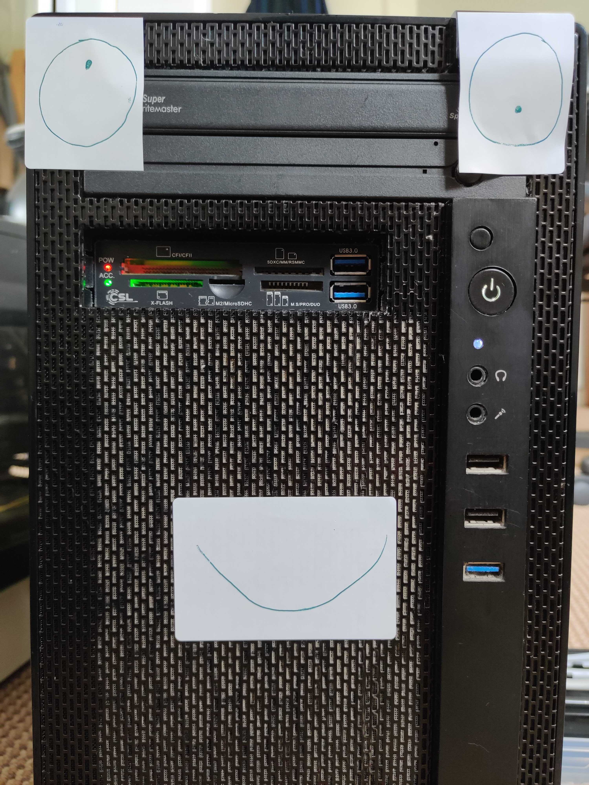

Codes and scripts for controlling the wretched Build-boy 
--------------------------------------------------------

Layout
======

Control scripts for each distro are available in `Scripts`. In most cases, each distro uses the same logic
(available in `Scripts/buildboy`) just using a different target directory (to match the OS name). More difficult
OS's may require their own separate logic. Each build script in `Scripts/[repo]` is run under a VM for that
repo.

`Builds` contains a log of previous builds. Build-boy uses this to know when a new release is available.
If the current version of Digichem is the same as the last version in the relevant `Builds` folder, 
Digichem goes back to sleep.

`Scripts/Command` contains the master build script, used to run the other VMs.

